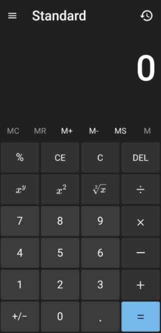
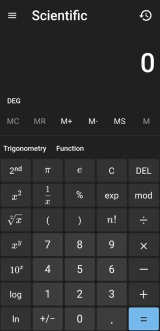
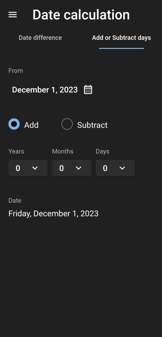
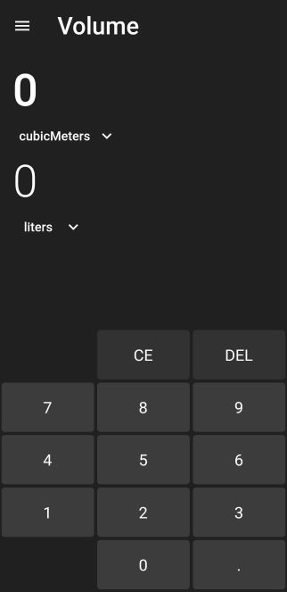
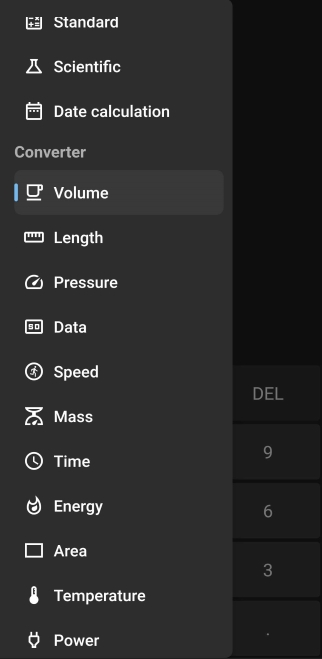

# Windows calculator clone

Windows 10 calculator clone written using dart and flutter
## Features
 - Standard calculator
 - Scientific calculator
 - Date calculation
 - Unit converter(Volume, Length, Pressure, Data, Speed, Mass, Time, Energy, Area, Temperature, Power, Angle)
## Calculator
 
## Date calculator
 
## Unit converters
 